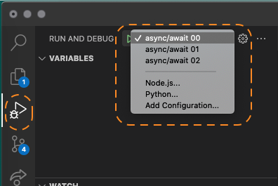
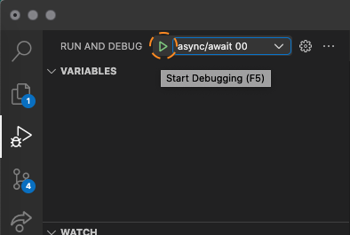

# Fun with Promises

## How to run the exercises

**Add a breakpoint in the main** function in the exercise you want to check.

Go to debug option and select the exercise in the select list

Click on the play button and enjoy

## Exercise 00

Create function _f3_. This function must to:

- call f1 with 4
- call f2, with the result of f1
- return f1 + f2

Call _f3_ function into _main_ function.

## Exercise 01

Create function _f3_. This function must to:

- call f1 with 5
- call f2 with 2
- return f1 + f2 

Call _f3_ function into _main_ function.

## Exercise 02

Create function _f3_. This function must to:

- call f1 with 4
- call f2 with the result of f1
- return the value of f2

Call _f3_ function into _main_ function.

## Exercise 03

### Part 1
Create function _f3_. This function will receive an array of numbers.

For each number:

- call f1 with the number
- return the result of f1

Then, sum all the results of f1 and return it

Tips: 
- the final sum is 36
- [MDN Array](https://developer.mozilla.org/es/docs/Web/JavaScript/Reference/Global_Objects/Array)

### Part 2 (bonus)
Create function _f3_. This function will receive an array of numbers.

For each number:

- call f1 with the number
- call f2 with the result of f1
- return the result of f2

Then, sum all the results of f2 and return it

Tip: 
- the final sum is 72

## Bonus track: error

Execute the error.js example to see what is happening...